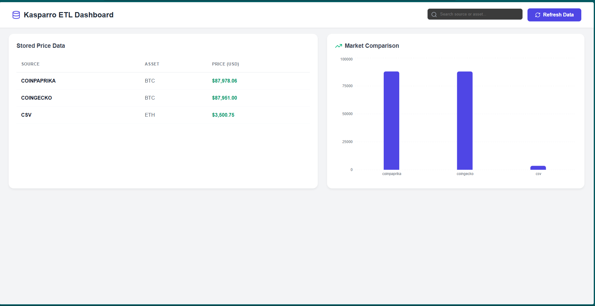
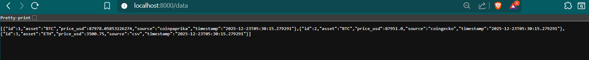
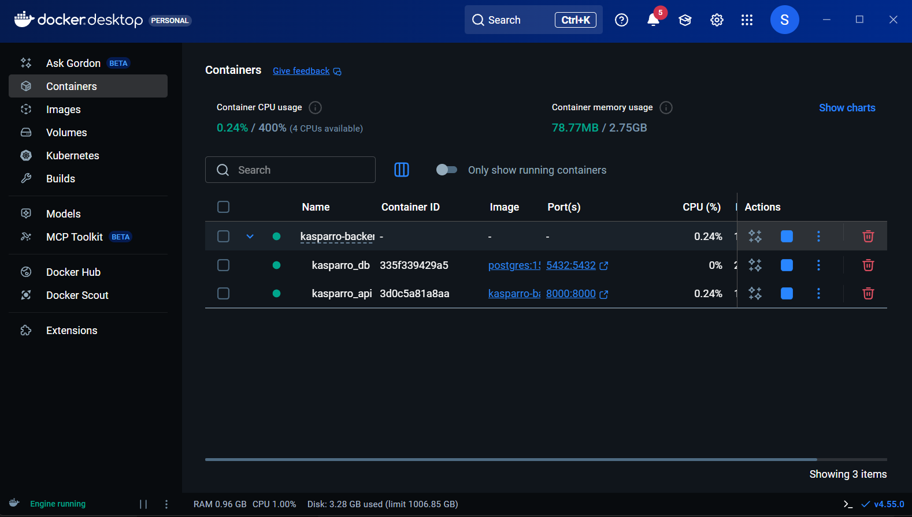

# 📊 Kasparro Full-Stack ETL & Dashboard

A professional full-stack solution developed for an internship assessment. This project automates the extraction of cryptocurrency data from multiple sources, normalizes it into a PostgreSQL database, and visualizes market trends through a modern React dashboard.

## 🚀 Requirement Completion Status
* **P0.1 Data Normalization**: Successfully implemented a unified schema to ingest data from CoinPaprika, CoinGecko, and local CSV files.
* **P0.3 Database Integration**: Fully containerized PostgreSQL 15 database running with automated schema initialization.
* **P1.1 Dashboard UI**: Built a professional, full-width React dashboard using Vite for high performance.
* **P1.2 Search/Filter**: Integrated a real-time search component to filter assets by name or source.
* **P1.3 Data Visualization**: Implemented interactive bar charts using Recharts to compare asset prices across different platforms.
* **Deployment**: Deployed to Render with public URL: https://kasparro-backend-subhali-ar-otti.onrender.com/

---

## 🛠️ Technology Stack
* **Backend**: FastAPI (Python 3.11)
* **Database**: PostgreSQL 15 (Dockerized)
* **Frontend**: React (Vite) + Recharts + Lucide-React
* **Infrastructure**: Docker & Docker Compose

---

## 📸 Project Gallery

### Modern Dashboard UI (P1.1, P1.3)

*Full-screen layout featuring a live data table and price comparison chart.*

### Normalized API Response (P0.1)

*JSON output showing unified data from all three sources.*

### Dockerized Infrastructure (P0.3)

*Backend and Database services running in isolated containers.*

---

## ⚙️ Setup & Installation

### 1. Launch the Infrastructure
Navigate to the backend directory and start the Docker services:
```bash
cd kasparro-backend
docker-compose up --build -d